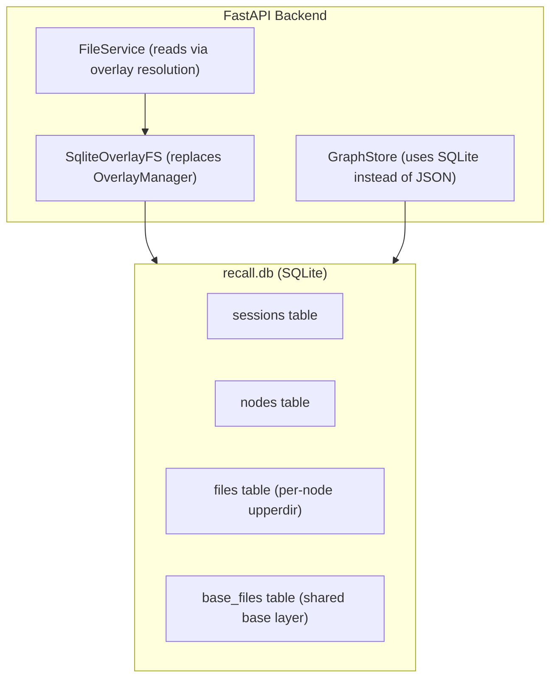

# OverlayFS to SQLite Migration Plan

## Current Architecture (what changes)

The backend has four core services wired together in `[backend/app/services/container.py](backend/app/services/container.py)`:

- `**OverlayManager**` (`[backend/app/services/overlay_manager.py](backend/app/services/overlay_manager.py)`) -- Linux kernel `mount -t overlay` calls, `/proc` checks, mount lifecycle, TTL tracking
- `**GraphStore**` (`[backend/app/services/graph_store.py](backend/app/services/graph_store.py)`) -- In-memory graph persisted as JSON files, creates physical `upper/work/merged` directories
- `**FileService**` (`[backend/app/services/file_service.py](backend/app/services/file_service.py)`) -- Reads/writes files on the real filesystem `merged` path
- `**CleanupWorker**` (`[backend/app/services/cleanup.py](backend/app/services/cleanup.py)`) -- Background unmount of idle mounts

Every route in `[backend/app/api/routes/](backend/app/api/routes/)` calls `overlay_manager.mount_node(node)` before file operations and passes real filesystem paths to `FileService`.

The frontend at `[frontend/src/state/types.ts](frontend/src/state/types.ts)` exposes `NodeDTO` with `lowerdirs`, `upperdir`, `workdir`, `merged`, and `mount_state` fields, all surfaced in the `[LayerInspector](frontend/src/components/LayerInspector.tsx)`.

---

## Target Architecture

Replace the physical overlay filesystem with a **single SQLite database** that implements the same copy-on-write semantics in userspace. Inspired by [Turso AgentFS](https://docs.turso.tech/agentfs/introduction), which stores an inode-like filesystem in SQLite with whiteout markers for deletions.



### SQLite Schema

```sql
-- Base layer files (equivalent to overlay_lab/base/)
CREATE TABLE base_files (
    path        TEXT PRIMARY KEY,
    content     BLOB,
    is_dir      INTEGER NOT NULL DEFAULT 0,
    size        INTEGER NOT NULL DEFAULT 0,
    created_at  TEXT NOT NULL
);

-- Sessions (replaces overlay_lab/sessions/*.json)
CREATE TABLE sessions (
    session_id      TEXT PRIMARY KEY,
    name            TEXT,
    root_node_id    TEXT NOT NULL,
    active_node_id  TEXT NOT NULL,
    color           TEXT NOT NULL,
    created_at      TEXT NOT NULL
);

-- Nodes (replaces overlay_lab/nodes/<id>/ directories)
CREATE TABLE nodes (
    node_id         TEXT PRIMARY KEY,
    parent_node_id  TEXT,
    session_id      TEXT NOT NULL REFERENCES sessions(session_id),
    created_at      TEXT NOT NULL
);

-- Per-node file changes (equivalent to upperdir)
-- This is the copy-on-write delta layer per node
CREATE TABLE node_files (
    node_id     TEXT NOT NULL REFERENCES nodes(node_id),
    path        TEXT NOT NULL,
    content     BLOB,           -- NULL when whiteout=1
    is_dir      INTEGER NOT NULL DEFAULT 0,
    size        INTEGER NOT NULL DEFAULT 0,
    whiteout    INTEGER NOT NULL DEFAULT 0,  -- 1 = file deleted at this layer
    created_at  TEXT NOT NULL,
    PRIMARY KEY (node_id, path)
);
```

### Copy-on-Write Resolution (core algorithm)

The key function that replaces kernel OverlayFS -- reading the "merged" view for a node:

```python
def resolve_merged_files(node_id: str) -> dict[str, FileRecord]:
    """Walk the ancestry chain top-down, applying COW semantics."""
    ancestry = get_ancestry_chain(node_id)  # [node, parent, grandparent, ...]

    merged: dict[str, FileRecord] = {}

    # Start from base layer
    for base_file in get_base_files():
        merged[base_file.path] = base_file

    # Apply each ancestor's upper layer bottom-up (oldest first)
    for ancestor_id in reversed(ancestry):
        for entry in get_node_files(ancestor_id):
            if entry.whiteout:
                merged.pop(entry.path, None)  # deletion marker
            else:
                merged[entry.path] = entry    # override / add

    return merged
```

This directly mirrors how OverlayFS works:

- **Read**: check upperdir first (newest ancestor), fall through to lowerdirs, then base
- **Write**: insert into `node_files` for the current node (only the active node's upper layer)
- **Delete**: insert a whiteout marker in `node_files` for the current node
- **Branch**: new node just points to parent -- zero data copy (the ancestry chain gives it all lowerdirs)

---

## File-by-File Change Plan

### Backend -- New files

- `**backend/app/services/sqlite_overlay.py` (NEW) -- Core SQLite overlay engine
  - `SqliteOverlayFS` class replacing `OverlayManager`
  - Methods: `resolve_file(node_id, path)`, `resolve_merged_files(node_id)`, `write_file(node_id, path, content)`, `delete_file(node_id, path)`, `get_ancestry_chain(node_id)`, `get_node_upper_files(node_id)`, `get_base_files()`
  - Preflight now always returns success (no Linux/mount checks needed)
  - No mount/unmount concept -- nodes are always "available"
- `**backend/app/services/db.py` (NEW) -- SQLite database initialization
  - Schema creation, connection management
  - Single `recall.db` file in the configured data root
  - Uses Python's built-in `sqlite3` module (zero new dependencies)

### Backend -- Modified files

- `**[backend/app/services/graph_store.py](backend/app/services/graph_store.py)` -- Major rewrite
  - Remove JSON file persistence, replace with SQLite reads/writes to `sessions` and `nodes` tables
  - Remove `create_node_dirs()` (no more physical directories)
  - Remove `_normalize_lowerdir_references()` and `_expand_lowerdirs()` -- ancestry is now implicit via `parent_node_id` chain in the `nodes` table
  - Remove `lowerdirs`/`upperdir`/`workdir`/`merged` from `NodeRecord` -- these become virtual concepts resolved at query time
  - Keep the same public API surface (`create_session`, `create_node`, `set_active_node`, `reset_graph`, etc.)
- `**[backend/app/services/file_service.py](backend/app/services/file_service.py)` -- Major rewrite
  - Replace `Path`-based filesystem reads with calls to `SqliteOverlayFS.resolve_merged_files()`
  - `write_file` inserts into `node_files` table instead of writing to disk
  - `delete_file` inserts a whiteout marker instead of `unlink()`
  - `list_files` queries the resolved merged view
  - `diff_nodes` compares resolved merged views of two nodes (logic stays the same, data source changes)
- `**[backend/app/services/cleanup.py](backend/app/services/cleanup.py)` -- Remove or simplify
  - No mount lifecycle to manage
  - Could keep as a stub for future use (e.g., pruning old sessions) or remove entirely
- `**[backend/app/services/container.py](backend/app/services/container.py)` -- Update wiring
  - Replace `OverlayManager` with `SqliteOverlayFS`
  - Initialize shared SQLite connection/path
  - Remove `CleanupWorker` (or keep as no-op)
- `**[backend/app/core/models.py](backend/app/core/models.py)` -- Simplify `NodeRecord`
  - Remove: `lowerdirs`, `upperdir`, `workdir`, `merged`, `mount_state`
  - Keep: `node_id`, `parent_node_id`, `session_id`, `created_at`
  - These overlay path fields become **virtual/computed** in the API layer for backward compatibility with the frontend layer inspector
- `**[backend/app/core/schemas.py](backend/app/core/schemas.py)` -- Adapt DTOs
  - `NodeDTO`: keep `lowerdirs`, `upperdir`, `workdir`, `merged` as virtual descriptors (e.g., `"node:<id>/upper"`, `"node:<parent_id>/upper"`, ...) so the Layer Inspector still has meaningful labels to display
  - Replace `mount_state` with a simpler `status` field (always "available") or keep it as a legacy field that always reads "mounted"
  - `HealthPreflightDTO`: change to reflect SQLite readiness instead of Linux/overlay checks
  - `LayerFilesResponse`: still works -- "upper" shows `node_files` for that node, "lower" shows parent's upper, "merged" shows resolved view
- `**[backend/app/core/config.py](backend/app/core/config.py)` -- Simplify
  - Remove mount TTL / cleanup interval settings
  - Add `db_path` setting (default: `overlay_lab/recall.db`)
  - Keep `overlay_root` as the parent directory for the DB file
- `**[backend/app/core/errors.py](backend/app/core/errors.py)` -- Update error codes
  - Remove: `OVERLAY_NOT_SUPPORTED`, `MOUNT_FAILED`, `UNMOUNT_FAILED`
  - Add: `DB_ERROR` for SQLite failures

### Backend -- Routes changes

All routes in `[backend/app/api/routes/](backend/app/api/routes/)` need the `overlay_manager.mount_node()` calls removed:

- `**[sessions.py](backend/app/api/routes/sessions.py)` -- Remove `mount_node()` / `mount_state` updates. Session create and branch just insert into SQLite.
- `**[nodes.py](backend/app/api/routes/nodes.py)` -- Remove `mount_node()` calls. Node create inserts a row. Revert updates `active_node_id`. Layer info computes virtual paths from ancestry.
- `**[files.py](backend/app/api/routes/files.py)` -- Remove `mount_node()` calls. File ops go through `SqliteOverlayFS`. Layer files endpoint queries the appropriate layer from SQLite.
- `**[diff.py](backend/app/api/routes/diff.py)` -- Remove `mount_node()` calls. Diff resolves both nodes' merged views from SQLite.
- `**[admin.py](backend/app/api/routes/admin.py)` -- Reset drops and recreates SQLite tables instead of unmounting + deleting directories.
- `**[health.py](backend/app/api/routes/health.py)` -- Preflight checks SQLite is writable instead of checking Linux/overlay support.

### Backend -- Remove/deprecate

- `**[backend/app/services/overlay_manager.py](backend/app/services/overlay_manager.py)` -- Delete entirely
- `**[backend/app/utils/subprocess_safe.py](backend/app/utils/subprocess_safe.py)` -- Delete (no more `mount`/`umount` subprocess calls)
- `**[backend/app/utils/paths.py](backend/app/utils/paths.py)` -- Simplify: remove `safe_join` (no filesystem paths), keep `validate_relative_file_path`

### Frontend changes

- `**[frontend/src/state/types.ts](frontend/src/state/types.ts)` -- `NodeDTO` keeps the same shape for backward compat. `mount_state` always "mounted". `HealthPreflightDTO` changes: replace `linux`/`overlay_supported`/`mount_capable` with a single `ready: boolean`.
- `**[frontend/src/App.tsx](frontend/src/App.tsx)` -- Update preflight check logic to use new `ready` field instead of `linux && overlay_supported && mount_capable`.
- `**[frontend/src/components/LayerInspector.tsx](frontend/src/components/LayerInspector.tsx)` -- Works as-is if backend returns virtual path labels. The file preview on hover still calls the same API endpoints.
- `**[frontend/src/components/GraphCanvas.tsx](frontend/src/components/GraphCanvas.tsx)` -- Mount state badge can show "available" instead of "mounted"/"unmounted", or we keep showing "mounted" always.
- Other components (`FilePanel`, `DiffViewer`, `OverlayLearningCue`) -- Minimal or no changes needed.

### Infrastructure changes

- `**[Dockerfile](Dockerfile)` -- Remove `apt-get install util-linux`, remove `privileged: true` requirement, no more `overlay_lab/base` directory copy. Add sqlite3 if not in base image (it is in Python slim).
- `**[docker-compose.yml](docker-compose.yml)` -- Remove `privileged: true`. Volume now stores a single `recall.db` file.
- `**[pyproject.toml](pyproject.toml)` -- No new dependencies needed (`sqlite3` is in Python stdlib). Optionally add `aiosqlite` if we want async DB access.
- `**[Makefile](Makefile)` -- Remove sudo/root requirement notes from README. Commands stay the same.

### Tests

- `**[backend/tests/test_overlay_manager.py](backend/tests/test_overlay_manager.py)` -- Delete and replace with `test_sqlite_overlay.py` testing COW resolution, whiteout markers, ancestry chains
- `**[backend/tests/test_graph_store.py](backend/tests/test_graph_store.py)` -- Update to use SQLite-backed store instead of JSON files
- `**[backend/tests/test_api.py](backend/tests/test_api.py)` -- Remove `FakeOverlayManager`, tests should work against real SQLite (in-memory `:memory:` DB for tests)

---

## Feature Parity Checklist

| Current Feature                        | SQLite Equivalent                                                     |
| -------------------------------------- | --------------------------------------------------------------------- |
| `mount -t overlay` with lowerdir chain | Ancestry chain walk in `nodes` table                                  |
| upperdir (per-node writes)             | `node_files` table filtered by `node_id`                              |
| lowerdir (read-through)                | Parent chain's `node_files` + `base_files`                            |
| merged view                            | `resolve_merged_files()` -- union of all layers with COW              |
| whiteout (OverlayFS `.wh.` files)      | `whiteout=1` column in `node_files`                                   |
| Branch session                         | New session + node with `parent_node_id` pointing to source           |
| Revert                                 | Update `active_node_id` (unchanged)                                   |
| Diff between nodes                     | Compare two resolved merged views (unchanged logic)                   |
| Layer inspection                       | Query `node_files` for specific `node_id` (upper) or ancestor (lower) |
| Idle mount cleanup                     | Not needed -- no mounts to manage                                     |
| Preflight health check                 | Check SQLite DB is writable                                           |
| Admin reset                            | `DELETE FROM` all tables                                              |

---

## Migration Order

The changes should be done in this order to minimize broken intermediate states:

1. Create the SQLite DB layer (`db.py`) and schema
2. Build `SqliteOverlayFS` with COW resolution logic
3. Rewrite `GraphStore` to use SQLite
4. Rewrite `FileService` to use `SqliteOverlayFS`
5. Update `container.py` wiring
6. Update all API routes (remove mount calls)
7. Update models, schemas, config, errors
8. Update frontend types and preflight logic
9. Update tests
10. Update Dockerfile, docker-compose, README
11. Delete old files (`overlay_manager.py`, `subprocess_safe.py`)
